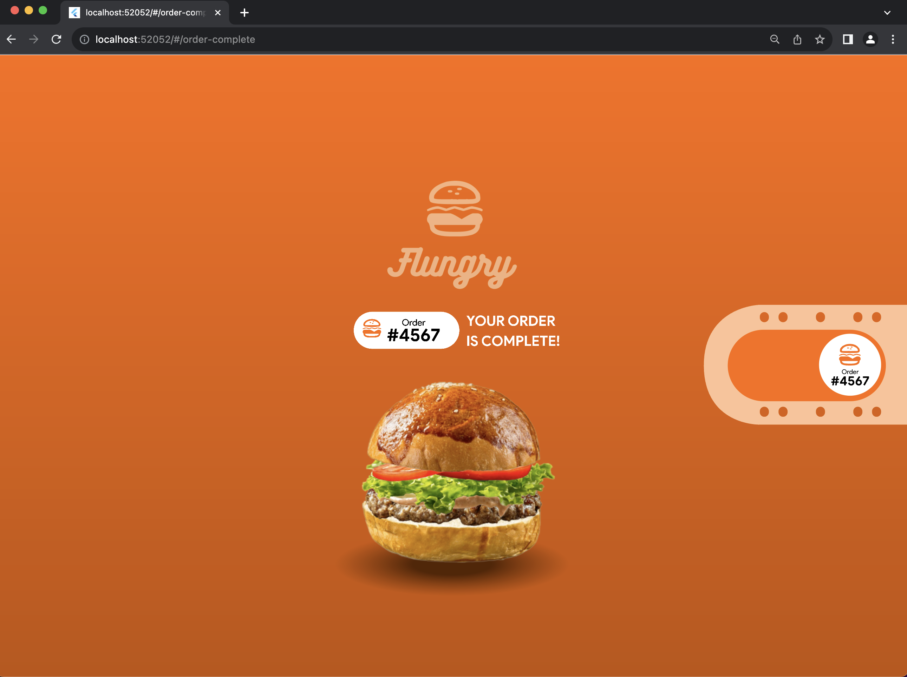
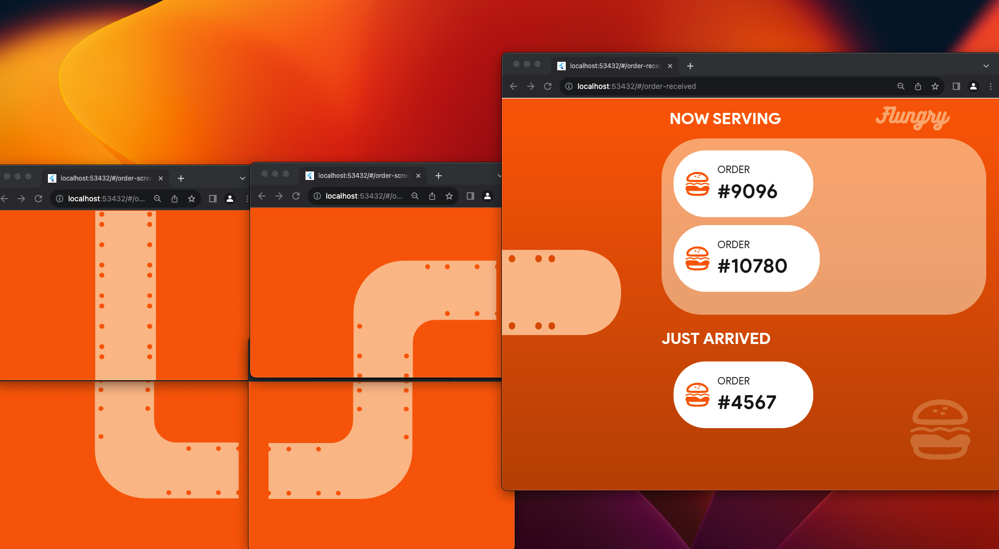
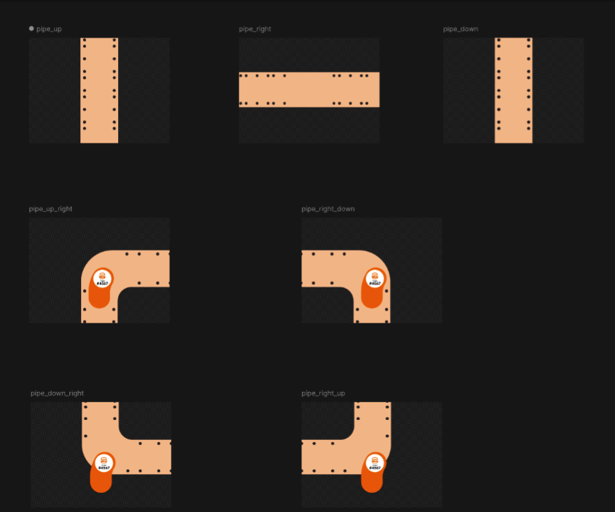

# flungry

Here's how you get the Flungry project working to get the moving order from screen to screen.

Watch the implementation running posted on my YouTube Channel 

This is a web project, so you should run it with multiple browser windows.
The main window is where I do the simulation of processing the burger order. 
Once the order is complete, the main screen switches to the /order-complete screen, from where things get triggered.

You can make the flow as long as you want. For this example I'm doing only 4 screens plus the /order-received screen.

When the app is running, then spawn as many tabs as you want on the page route called /order-screen with the following query parameters:

## locahost/order-screen?screenIndex=1&artboard=pipe_up&secs=3 ##

where **screenIndex** is the index of the screen in the flow sequence,
**artboard** is the animation that you want to play inside that screen
**secs** is the amount of seconds the animation takes. I'm gonna improve this but for now you pass 3 as all animations take 3 seconds.

You would lay them out like this:

These are the multiple artboards available, since the flow is from left to right:
- pipe_up
- pipe_down
- pipe_right
- pipe_up_right
- pipe_right_down
- pipe_down_right

You decide which index is which and which artboard is the one to animate on each given screen. I just pushed a small update on the Github repo. Check for a property called **maxScreenIndex**, and then just change it for the value of your last screen index (in my case, 4).

Your Firebase structure should look like this:
- A collection called order_screens.
- Documents for each of the screens (i.e. screen1, screen2, screen3, screen4).
- Each document has a property called animate which is a boolean flag, that at the end of the flow they should get reset.

Again this is the prototype I created, but you can feel free to take it much further and play with it.

Good luck!
